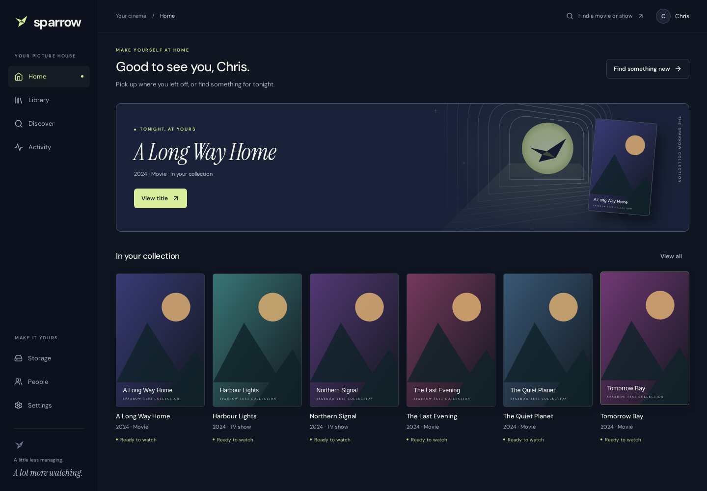

# Sparrow

Sparrow brings your movies and TV shows into one collection: find something,
choose exactly what to request, let its agents organise the result, and watch
from a phone or desktop browser. A Linux server coordinates storage nodes;
media can stay on a Windows machine.

This checkout implements the household product foundation. It is still an
alpha: Linux/container and Chrome checks are recorded in
[the implementation record](docs/IMPLEMENTATION.md). Physical Windows, Safari/iOS
and real-provider quality checks must pass before those deployments are called
validated. No Windows installer has been published by this working-tree change.



## What is included

- Owner onboarding, invitations, roles, scoped storage access and revocable
  browser sessions. Household preferences are inherited, with personal and
  explicit request overrides inside the server's limits.
- Exact movie/episode requests, visible progress, pause/cancel/retry and revisions
  that invalidate stale agent actions. Publication verifies actual media and
  preserves staging originals and previous library copies.
- Portable outbound storage-node commands, pairing, import previews and match
  correction. An unavailable drive stays in the catalogue with saved progress.
- Responsive browser playback, seeking, audio/caption selection, per-person
  resume state and bounded format conversion. The web app can be installed where
  the browser has a trusted secure context.
- Built-in subtitle discovery, audio alignment and independent local speech
  checks, followed by a bounded quality-review agent. Originals survive; required
  subtitles cannot silently pass readiness. One-tap repair, file upload and
  personal delay controls are in the player. Automatic verification currently
  requires captions in the spoken language; translated tracks need further work.
- Tool-using conversational discovery and personal collection-care subscriptions.
  Follow new episodes, chosen seasons or all aired episodes; explicitly opt into
  quality upgrades. Unchanged idle collection state makes no model calls.

Guided external DNS/HTTPS/sharing (roadmap stage 7), TV/Emby/casting and the setup
agent are excluded from this implementation. Music and broader source support
remain later work. Discovery does not initiate acquisition without a request.

## Install

With Docker Engine and Compose on Linux:

```sh
docker compose up -d --build
docker compose exec -T sparrow python -m backend.agents.setup_info --url http://localhost:8888
```

The second command prints a setup link with the code already filled in, plus the
code for manual entry. Open the link and choose **Create administrator account**.
This creates the first administrator for your server; subsequent users join through
invitations. The code also appears in startup logs while setup is incomplete.
Installation agents should return the link and code to the owner, as described in
[AGENTS.md](AGENTS.md#installation-handoff). Use the owner's actual browser address
with `--url` when connecting over a LAN or SSH tunnel.

The container includes Python, the built frontend, FFmpeg and subtitle/speech
components. You do not operate a separate subtitle application.

Follow [the installation guide](docs/INSTALLATION.md) for LAN binding, Windows
node packaging/pairing, folder access, existing-media import and recovery.
Accounts, collection mappings and progress persist in the named data volume.

TMDB supplies title information, Anthropic supplies reasoning, and OpenSubtitles
can supply additional caption files. Add credentials in Server settings when
needed. Watching imported media does not require a model. Acquisition uses the
built-in source and a configured Transmission/qBittorrent connection. Use media
you are entitled to acquire and store.

## Develop and verify

Python 3.11, a maintained Node.js 22 installation and FFmpeg/ffprobe are required
for a source checkout:

```sh
python3.11 -m venv .venv
.venv/bin/pip install --require-hashes -r requirements.lock
cd frontend
npm ci
cd ..
scripts/check.sh
```

`./dev.sh` starts the development interface; `./start.sh` builds and runs it.
The tests use isolated state and generated/licensed speech fixtures. Optional
paid-model evaluations are skipped by default. Browser tests and screenshots
live in `tests/browser` and `docs/product-validation`.

The persistent tool runtime, job authority, node protocol and subtitle processing
are documented in [DESIGN.md](DESIGN.md), [the product design](docs/PRODUCT_DESIGN.md)
and [the roadmap](ROADMAP.md). Read [AGENTS.md](AGENTS.md) before contributing.
Packaging inputs and their provenance are in `packaging/sources.json`; media
packages include corresponding FFmpeg/x264 sources and build instructions.

See [CONTRIBUTING.md](CONTRIBUTING.md), [SECURITY.md](SECURITY.md),
[CODE_OF_CONDUCT.md](CODE_OF_CONDUCT.md) and [LICENSE](LICENSE).
