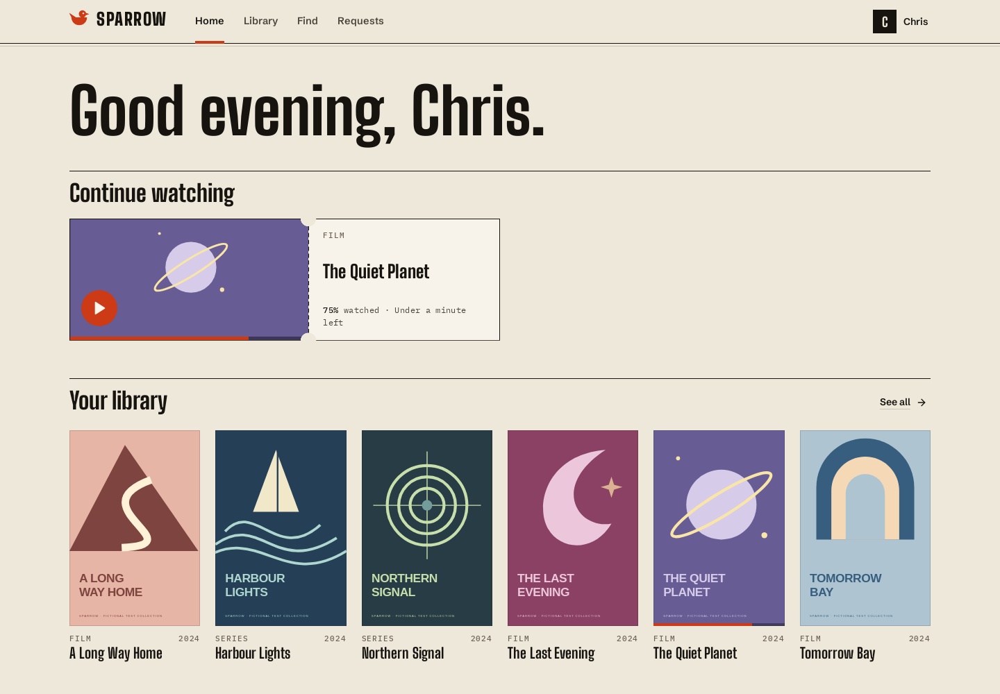
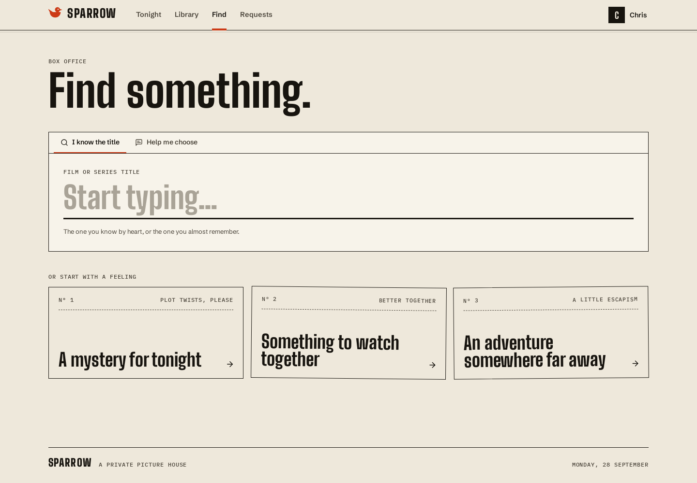
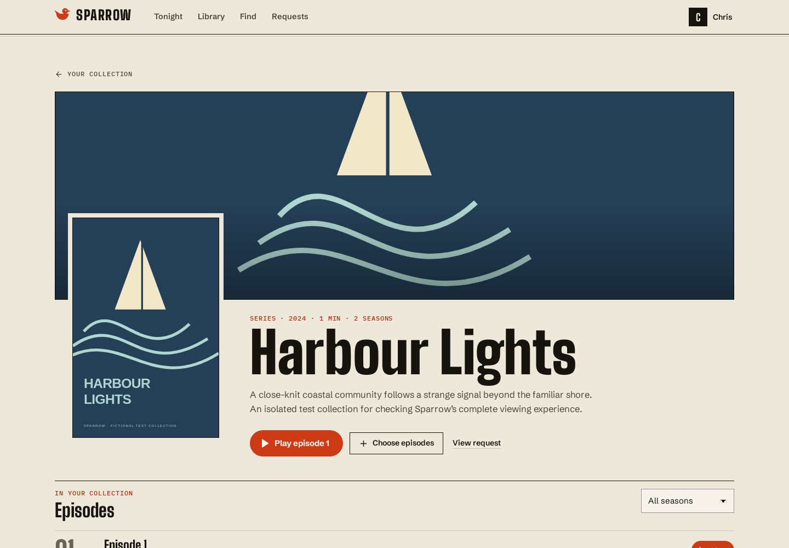
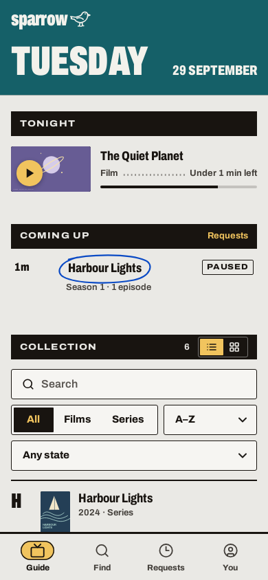
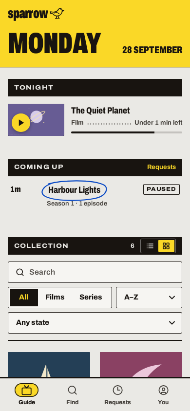

<p align="center">
  
</p>
<h1 align="center">Sparrow</h1>
<p align="center"><strong>Say what you want to watch.</strong><br />The household guide to your own films and series. Hosted by you.</p>
<p align="center">
  <a href="https://github.com/sf-chris/sparrow/actions/workflows/ci.yml"></a>
  <a href="LICENSE"></a>
  <a href="ROADMAP.md"></a>
</p>
<p align="center">
  <a href="#get-started">Get started</a> ·
  <a href="docs/screenshots/README.md">Take a look</a> ·
  <a href="docs/INSTALLATION.md">Installation guide</a> ·
  <a href="ROADMAP.md">Roadmap</a> ·
  <a href="CONTRIBUTING.md">Contribute</a>
</p>



Sparrow brings your media into one personal collection. Find a film or choose the
exact episodes you want, let its agents find and organise them, then settle in
and watch from your browser. Pick up where you left off, keep your preferences,
and make room for the rest of your household.

**Sparrow is an active alpha.** The interface and Linux install/import/watch flow
are implemented and tested. Feature reliability across real providers, Windows
storage and physical phones is the next focus; see [what still needs work](#what-still-needs-work).

## Make a night of it

- **One guide.** Tonight's resumes, what's coming up and your whole collection
  on one page, as an A–Z listing or covers. Arrow keys work from the couch.
- **One box.** Type a title, or describe a mood and ask Sparrow. Review the
  film, season or individual episodes before requesting.
- **Ask once, follow along.** Persistent agents inspect sources, verify media
  and organise the result. Requests shows progress and recovery actions; Logs
  keeps readable operational history with filters and expandable details.
- **A player that belongs here.** Watch in the browser with seeking, audio and
  caption choices, personal progress and an optional compatible playback format.
  Existing media works without an AI provider.
- **The little things, taken care of.** Built-in subtitle preparation and repair,
  plus personal subscriptions for new episodes, gaps and explicitly chosen
  quality upgrades. Unchanged idle collections make no model calls.
- **Room for your people.** Local accounts, invitations, storage permissions,
  household defaults, personal overrides and focused account/security controls.

<table>
  <tr>
    <td width="50%"></td>
    <td width="50%"></td>
  </tr>
  <tr>
    <td align="center"><strong>A title, or a mood.</strong></td>
    <td align="center"><strong>Exactly the episodes you want.</strong></td>
  </tr>
</table>

<p align="center">
  
  &nbsp;
  
</p>
<p align="center"><em>Actual application captures with fictional titles and original fixture artwork.</em><br /><a href="docs/screenshots/README.md">Browse the desktop and phone gallery →</a></p>

## Get started

The recommended server setup is **Linux with Docker Engine and Compose**.

```sh
git clone https://github.com/sf-chris/sparrow.git
cd sparrow
docker compose up -d --build
docker compose exec -T sparrow python -m backend.agents.setup_info --url http://localhost:8888
```

The first build takes several minutes and bundles the web app, FFmpeg and
subtitle/speech components. Open the setup link printed by the last command,
then choose **Create administrator account** and set your household defaults.
The link fills the setup code for you; you choose your own name and password.

Open **[localhost:8888](http://localhost:8888)** on the server, or through your SSH
tunnel. For another device at home, follow the [LAN setup instructions](docs/INSTALLATION.md#linux-server)
and pass that browser address to `--url`. Invite others from **Settings → People**.

Accounts, library mappings and progress persist in a named Docker volume.
The [installation guide](docs/INSTALLATION.md) covers media-folder mounts,
Windows storage pairing, imports, upgrades and backups. The container includes
subtitle processing; there is no separate subtitle application to run.

### Bring your collection

Connect storage in **Settings → Storage**, choose **Import files**,
review the matches, and open a title to play it. Media can stay on its storage
machine while the Linux server coordinates your collection.

Add only the services you need in **Settings → Server settings**:

| Service | Used for |
| --- | --- |
| TMDB | Movie/show metadata and title search |
| Anthropic | Discovery, acquisition, curation and subtitle-review reasoning |
| Transmission or qBittorrent | Downloads requested through Sparrow's built-in source. Setup finds one, or the Docker image runs its own Transmission |
| OpenAI (optional) | Cheaper subtitle page checks |
| OpenSubtitles (optional) | Additional caption candidates |

Imported-media playback needs no reasoning key. Provider accounts and paid model
usage are separate from Sparrow. Use media you are entitled to acquire and store.

## What still needs work

This merge establishes the approved bright design as the product's interface.
The next phase is making the remaining features consistently excellent:

- Native Windows installer/service and storage validation, including the full
  Windows-to-phone viewing journey.
- Physical mobile and Safari/iOS playback, subtitle and recovery checks.
- Live subtitle-provider and model-quality evaluations; automatic speech-based
  caption verification currently supports captions in the spoken language.
- A finished nearby-storage chooser; discovery is currently an opt-in prototype.

Guided external DNS/HTTPS/sharing, TV/Emby/casting, a setup agent, music and broader
source support remain deferred. No Windows installer is published by this merge.
The [implementation record](docs/IMPLEMENTATION.md) separates measured results
from open acceptance gates; the [roadmap](ROADMAP.md) records the full plan.

## Build with us

Sparrow uses **React + TypeScript**, **FastAPI + Python**, **SQLite** and **FFmpeg**.
The Linux server owns accounts, intent and agent sessions; storage nodes own
permitted files and local media processing. Agents make uncertain decisions in
persistent tool loops. Tools establish facts and enforce permissions and limits.
Read [DESIGN.md](DESIGN.md) and [AGENTS.md](AGENTS.md) before changing that boundary.

For source development, install Python 3.11, Node.js 22.12+, FFmpeg/ffprobe and
ripgrep, then run:

```sh
./scripts/install.sh
./scripts/check.sh
./dev.sh
```

The development UI runs on `http://localhost:3000`, with the backend on `:8888`.
`./start.sh` builds and serves the application from the backend. For Chrome
viewing, household and accessibility journeys, run `tests/browser/ci.sh` after
building; see [the contributor guide](CONTRIBUTING.md) for browser prerequisites,
isolated ports and screenshot regeneration.

[Report a bug](https://github.com/sf-chris/sparrow/issues/new?template=bug_report.yml),
[suggest a feature](https://github.com/sf-chris/sparrow/issues/new?template=feature_request.yml),
or help with a focused fix from the roadmap. Please use [SECURITY.md](SECURITY.md)
for private security reports and follow the [Code of Conduct](CODE_OF_CONDUCT.md).

## License and credits

Sparrow's code is [AGPL-3.0-or-later licensed](LICENSE). Its bird and illustrations are original
SVG artwork; bundled typography and its licenses are documented in
[the asset notes](docs/PRODUCT_DESIGN.md#artwork-and-font-provenance). Media dependencies retain their own
licenses: [third-party notices](packaging/THIRD_PARTY.md) and
[pinned source provenance](packaging/sources.json) accompany the packages.
