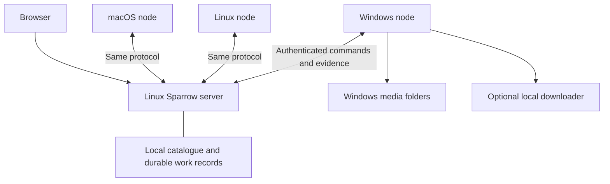

# Linux server and cross-platform media nodes

Status: node contract, originally planned 2026-09-09; implementation status reconciled 2026-09-11. Read with the updated
[product plan](PRODUCT_PLAN.md) and [roadmap](../ROADMAP.md). This document
defines the node boundary; its technical slices do not replace the complete
owner-experience acceptance gates. The portable protocol, Linux package and
node operations are implemented; physical Windows/service/NTFS and phone
acceptance remain open. See [measured implementation](IMPLEMENTATION.md).

## Intended experience

Run Sparrow's web application on Linux. Install Sparrow Node on a Windows,
macOS, or Linux machine, pair it with the server, and choose the folders it
may manage. The web application presents one collection and explains where
each title is available. Windows is the first final storage destination.

Day-to-day use should be: request exactly the intended title/episodes, find the
verified result, and play it in a phone or desktop browser with correctly timed
subtitles and personal resume state. Watching, subtitles, accounts and guided
sharing are core product scope; music remains later. Adding another storage
machine should require pairing and choosing storage, with useful diagnostics
when something goes wrong.

The first acceptance scenario is one Linux server and one Windows node. The
same protocol must accommodate macOS, Linux, and different networks. Supported
remote access is a required product outcome; the concrete route remains a
deployment input. All TV/Emby/casting work and the setup agent are parked.
The current node acceptance gates use phone and desktop browser playback.

## Historical starting point (9 September 2026)

The baseline at `b84450c` has a FastAPI server, React UI, persistent Fetch,
Media, and Librarian sessions, monitoring mandates, and library projections.
The current confidence suite passes 40 tests; two live-model evaluations are
opt-in. The frontend builds successfully.

Storage is tightly coupled to the server process:

- `backend/models.py` configures one staging directory, library directory,
  and torrent client. Inventory records contain machine-local paths.
- `backend/agents/tools.py` calls `Path`, `shutil`, and local ffprobe directly.
- `backend/agents/service.py` polls the client and checks local files during
  recovery. Events awaiting delivery are currently held in memory.
- `backend/main.py` contains additional legacy filesystem and library routes.
- `backend/doctor.py` assumes the server itself needs media folders and
  ffprobe. The existing service installer targets macOS.

The separation must cover recovery, doctor checks, API routes, and legacy
entry points as well as the agent tools. Completion today checks stored
verification and minimum quality; the new boundary must also tie those facts
to a particular file version and confirmed location.

## Node architecture

**The server owns intent and coordination.** Keep the UI, agentic discovery,
requests, mandates, agent reasoning, accounts, personal watch state, metadata,
journal and catalogue together. It records which work is authorised and which
node owns it, and authorises its native playback sessions for a particular
user. Future clients can build on these identities and playback contracts;
no TV integration is part of the active node implementation.

**Nodes own local execution and observations.** A node reports capacity and
availability, probes media, manages authorized files, and optionally controls
a local downloader. It enforces its folder boundaries independently. Its
commands are specific operations; they cannot execute arbitrary shell code.
The Media Agent remains a reasoning session on the server and uses node tools.

**Give nodes explicit capabilities.** Storage and probing are foundational;
downloading, subtitle analysis/alignment and transcoding are capabilities a
machine can offer. A storage-only node remains supported. For this deployment, my
provisional recommendation is to download on Windows alongside the final
storage when its availability and network make that practical. This reduces
whole-file transfers and temporary disk use on Linux. If Linux must download,
the first delivery must include a resumable transfer to Windows before the
request can count as durably stored there.

**Keep state local to its owning service.** A single Linux coordinator can
continue using SQLite on local durable storage. Each node has its own small
local operation database. Communication happens through the API. SQLite's
documentation describes locking and synchronization risks when database
files are accessed over network filesystems; that informs this choice.
[SQLite guidance](https://www.sqlite.org/useovernet.html).

## Persistent node contracts

1. **Identity and location.** Separate a catalogue title/episode, a media asset
   representing a particular file, and an asset's location. A location has a
   node ID, storage-root ID, node-local reference, byte size, file version,
   verification evidence, and last observation. Linux does not interpret a
   Windows drive path. Relative names are validated by the destination node.
   Additional copies can be represented without implementing replication yet.

2. **Ownership.** The server is the authority for desired state and grants;
   the node is the authority for local observations. Start with one explicitly
   chosen destination for each request. Pin it when work starts. Node outages
   do not silently reroute work or trigger replacement downloads.

3. **Durable operations.** Every command has a stable operation ID, payload
   identity, target node, job revision, and explicit scope. Persist assignment
   before sending. Nodes persist acceptance and results, reject reuse of an
   ID with different arguments, and reconcile uncertain outcomes after a
   crash. Repeated delivery must produce the same intended external effect.
   Use bounded leases/revisions to reject stale owners and serialize conflicting
   changes to the same asset. Downloader operations must reconcile client state
   when a crash happens between an external action and recording its result.

4. **Durable events.** Nodes persist observations until the server acknowledges
   them. Events have stable identities and ordering per node; the server applies
   them idempotently and commits resulting wake work durably. Reconnection
   replays missed events and reconciles an inventory snapshot. Browser
   WebSockets remain a view of that state, and can refresh after losing events.

5. **Explicit offline semantics.** Previously verified media can be stored but
   currently unavailable. Show the node's last contact time. A sleeping machine
   or disconnected drive does not imply deletion. Work waits for its destination;
   unchanged outages consume no repeated model reasoning. On reconnection,
   distinguish a missing volume from an absent file before changing inventory.

6. **Honest pause and cancel.** Record user intent immediately, invalidate older
   work, and show when node acknowledgement is pending. A disconnected node
   cannot be stopped instantly. Define which already-authorized bounded actions
   may finish offline and when their authority expires. Block new acquisition
   after expiry. Existing good library copies survive cancellation of pending
   work. Test cancellation racing a running tool and final publication.

7. **Evidence-based completion.** The server accepts a node's publication receipt
   only for the authorized asset/version and destination, with required probe
   evidence and storage confirmation. A receipt refers to the exact bytes
   checked. Hashes establish byte identity; they do not establish title identity.
   File duration alone also cannot prove which episode a file contains.

## Subtitle processing

Nodes run packaged subtitle inspection/alignment operations and return timing,
identity and sample evidence for central agent review. Commands carry the
resolved language/type preferences, file/audio-track version and request revision.
Ordinary processing does not need a new model decision at every step. Preserve
original tracks and distinguish shared repairs from personal playback offsets.

TV integration is parked. Retained Emby options and their future media-access
requirements live in the [product plan](PRODUCT_PLAN.md); they introduce no
current node capabilities or acceptance gates.

## File safety and platform behavior

Use a recoverable publication operation: reserve capacity, prepare an incoming
file on the destination volume, verify its identity and media evidence, flush
as supported, publish it, persist the receipt, then report it. A crash at any
boundary must be reconciled from the node ledger and actual files. Do not
assume a database transaction also atomically commits a filesystem change.

An upgrade retains the known-good copy until the replacement is recoverable
and publication is confirmed. Cleanup has its own recorded state. Cross-node
transfers keep the source until the target confirms success; interrupted
transfers resume and validate the completed content before publication.

Cross-volume moves require an explicit copy-and-verify path. Microsoft
documents that a Windows cross-volume move can be implemented as copy then
delete, even succeeding while leaving the source behind. A move result alone
is insufficient evidence of the final transaction state.
[Windows move behavior](https://learn.microsoft.com/en-us/windows/win32/api/winbase/nf-winbase-movefileexw).

The Windows implementation needs real tests for reserved filenames, case
collisions, Unicode, long paths, locked files, junctions/reparse points, and
service-account access. The node validates root and volume identity at execution
time, rejects paths escaping approved roots, and handles drive removal safely.
Path-prefix string checks are insufficient. Microsoft's naming rules describe
the relevant Windows differences.
[Windows naming rules](https://learn.microsoft.com/en-us/windows/win32/fileio/naming-a-file).

Plan seeding and publication together: the downloader may still need its
original bytes and path. The publication policy must preserve those until the
seeding obligation ends, using a supported link/copy/client relocation strategy
and accounting for temporary disk use. Never modify shared hard-linked bytes.

## Connectivity and installation

Use a versioned HTTPS protocol, provisionally with nodes initiating outbound
long-poll requests and posting results. Commands carry bounded, validated data.
Negotiate capabilities and reject incompatible versions clearly.

Pair through a short-lived, single-use enrollment flow bound to the intended
server, then issue a unique revocable credential for each node. Validate TLS
identity; support credential rotation. Nodes receive only the secrets needed
for their own tools. Account login and authorization belong in the Linux UI
before supported remote exposure; a node credential cannot administer the server.

For an initial deployment spanning networks, an existing private network such
as Tailscale is a candidate. Its documentation distinguishes direct and relayed
connections, with performance consequences for large media transfers. We should
measure the actual route before selecting a playback topology. The node protocol
should work over ordinary authenticated HTTPS too.
[Tailscale connection types](https://tailscale.com/docs/reference/connection-types).

Provisional packaging: one Linux Compose deployment with the frontend already
built, plus a native node installer/service for Windows. Package macOS and Linux
nodes from the same protocol implementation. Prefer reusing the Python tools
initially, but prove clean-machine installation and Windows service behavior
before committing to that packaging approach. The owner should not need a Python
or Node development environment to install a release.

Installation should offer pairing, folder selection, an actual write/probe
check, startup after reboot, and a plain-language health page. Release work
includes verified/signed artifacts, supported platform versions, dependency
packaging, protocol compatibility, upgrades, and tested rollback. Removing the
software must preserve the media collection.

## Node implementation slices and acceptance gates

These slices prove the execution subsystem. Product milestones also require
browser/mobile viewing, subtitles and household access. Follow the
[product delivery order](../ROADMAP.md#current-implementation-sequence); these
technical slices are not separate release milestones. Test the actual media
route early and complete the first import-and-watch journey before broadening
platform support.

| Slice | Deliverable | Acceptance gate |
| --- | --- | --- |
| 1. Prove the installation boundary | Linux production packaging and a minimal Windows node that pairs, reports a selected root, and probes a generated fixture | Fresh Linux install serves onboarding; a Windows service reconnects after reboot and reports the fixture's real media facts |
| 2. Establish contracts locally | Node/asset/location schema, migrations, durable operations/events, and a local executor behind the same interfaces | Existing acquisition tests pass; injected crashes and duplicate commands reconcile; an existing local library migrates without changing media files |
| 3. Complete one Windows request | Route Fetch/Media tool execution to the Windows node; persist remote evidence; project availability in the UI | One test movie and one TV-episode fixture reach verified storage on Windows through Linux; restart either process and interrupt the connection mid-work |
| 4. Harden the owner deployment | Fault tests, seeding-aware publication, disk reservations, diagnostics, installation, backup/restore, compatible upgrades | Pass the failure matrix below on real Windows/NTFS and Linux; install from release artifacts on a clean Windows account; restore server state and reconcile the node |
| 5. Complete the owner media journey | Connect these contracts to Sparrow browser/mobile playback, subtitle preparation and authenticated household access | Play and seek from Windows storage, repair subtitle timing, resume as the same user on another device and recover from a disconnected node |

Slice 3 includes resumable byte transfer if the chosen downloader is on Linux.
macOS and Linux node implementations must run the same contract tests before
their platform support is declared complete. Cross-network connectivity gets a
real acceptance test, not only a same-machine simulation.

Playback uses the same asset identity and node authorization. The design must
allow seeking and direct play from the storage node or through an authenticated
gateway. Direct browser access needs a reachable, browser-trusted HTTPS endpoint;
outbound command connectivity alone does not provide a video path. Choose the
first streaming route after confirming network locations and target browsers.
Transcoding placement should follow actual node capabilities and bandwidth.

## Required failure matrix

- Kill either process during download, probe, publication, and result delivery.
- Duplicate, delay, drop, and reorder commands/events; replay after restart.
- Race two jobs for the last transfer slot or last available disk capacity.
- Cancel or pause while a tool is running or the node is disconnected.
- Sleep Windows, reboot it, remove a drive, change its letter, or deny access.
- Fill the disk during publication; lock the destination file; corrupt incoming
  bytes; encounter an existing filename or an unexpected filesystem link.
- Preserve seeding data while publishing, cancelling, and upgrading media.
- Revoke a node credential; attempt expired enrollment and out-of-root access.
- Upgrade server and node in either supported order; exercise rollback.
- Restore an older server backup without resurrecting cancelled work or deleting
  newer verified media. Reconcile generations and receipts conservatively.

Tests should assert externally visible outcomes: surviving good files, one
committed publication, bounded resource use, and correct UI state. Supplement
unit tests with isolated processes, real filesystems, controlled downloader
fixtures, and actual Windows service tests. Real content-acquisition smoke tests
use authorized fixtures. Live-model evaluations remain separately budgeted.

## Decisions for the next discussion

Playback, subtitle preparation and household access are now core requirements.
Confirm network locations, download location, Windows version/hardware, storage
volumes, sleep behaviour and existing media when selecting the first deployment.
These facts select the concrete routes and supported capabilities. TV/Emby
details are parked and are not required inputs to node implementation.

The server backup covers catalogue, intent, pairing recovery, and operation
state. Media backup is a separate owner policy: one Windows copy gives storage
capacity, not protection against drive failure. Decide replication/backup needs
explicitly before defining later automatic placement behavior.
