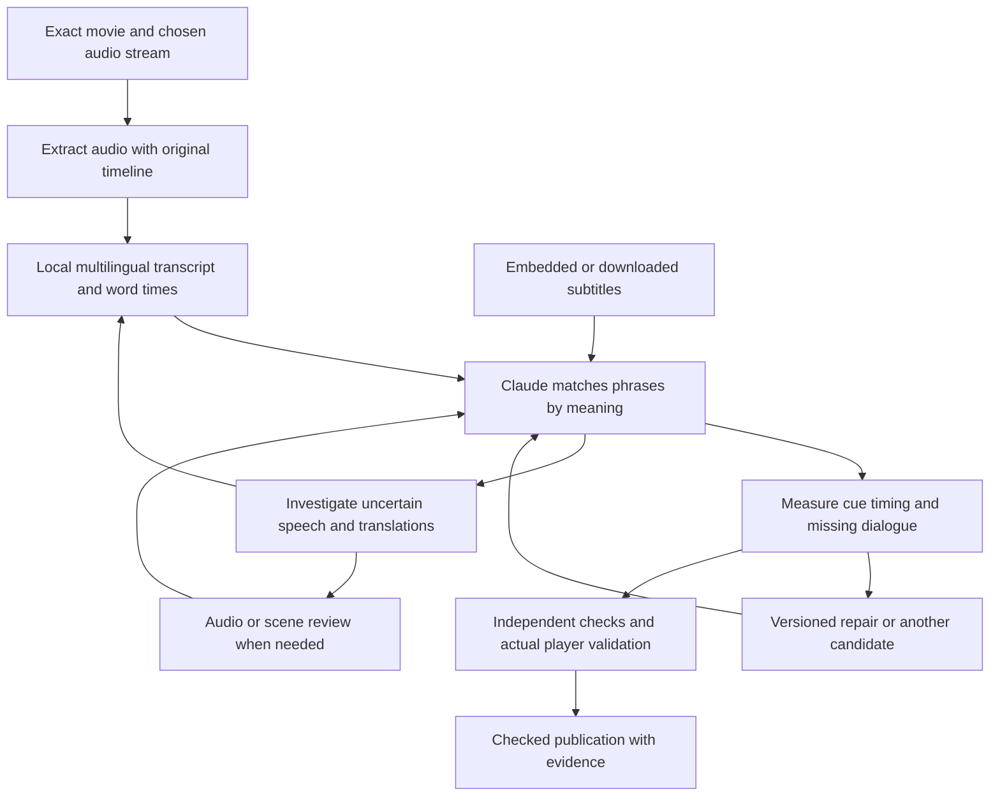

# Subtitle discovery, speech alignment and quality review

Updated 30 September 2026. **Watchability is the owner-approved acceptance standard.**
The opt-in [audio feasibility trial](agentic-audit/SUBTITLE_TRIAL.md) ran on
licensed English fixtures. The subsequent [Four Lions trial](agentic-audit/FOUR_LIONS_TRIAL.md)
downloaded the real movie, sampled foreign speech, ran live Claude comparisons
using the existing CLI login and checked native browser captions. It exposed
recognition and semantic-review failures. The 30 September iteration added
evidence-backed draft repairs and actual Sparrow-player checks at 24 positions;
the owner subsequently clarified that minor translation uncertainty is not a
timing blocker. Four Lions passes practical watchability on the recorded evidence.
This case pass does not establish general production or unattended acceptance.
This develops stage 5 and issue #3/P6 within the [product plan](PRODUCT_PLAN.md),
[agentic handoff](AGENTIC_PLAN.md) and [implementation ledger](agentic-audit/IMPLEMENTATION.md).
Keep their delivery sequence. Stage 7, TV/Emby/casting and the setup agent remain excluded.

The subsequent anime implementation adds default subtitle inclusion, optional
paid sync checking and per-episode/player get/check/fix controls. Its production
review loop compares verbatim source-phrase quotes with independent timestamps;
the larger investigation/repair loop below remains the target, not a claim that
every experimental Four Lions tool is wired into routine production review.
The [anime trial record](agentic-audit/ANIME_SUBTITLE_TRIAL.md) reports three real
episode passes, rejection controls, UI checks and the measured limits.

**Current scope (30 September):** foreign-language audio with English captions.
The product now builds whole-soundtrack speech evidence, measures and corrects
caption timing without a model call, and, when checking is on, has Claude Opus 5.5
review the track page by page, writing its own gloss before each page's captions
are revealed, with a tool-enforced approval gate. The
[evidence record](agentic-audit/SUBTITLE_EVIDENCE.md) documents the measurements,
heuristics and validation boundary. Sections below describe the original plan.

**Latest direction:** use the owner's proposed audio-first approach. Extract the
actual soundtrack, transcribe speech in its original language with word timings,
then use the existing Claude agent to match its meaning against subtitle cues.
Measure timing from those correspondences. Keep direct audio/scene review for
uncertain passages and final playback acceptance. A large audiovisual model
reviewing every scene is no longer the proposed prerequisite.

The owner's quality objective is: can someone comfortably watch with this track?
It must load/render, match the actual movie/episode and follow the voice without
a sustained offset or drift. Meaning establishes correspondence for timing;
translation prose is not being perfected. Minor wording errors or a few seconds
of uncertainty are acceptable when the broader identity/timing evidence is good.
Preserve usable captions. Broken tracks, wrong content, substantial missing
dialogue and material timing problems still require investigation or repair.
Matching speech activity, trusting a release name or receiving a successful
process exit does not establish that correspondence. Account/key preference:
local processing plus the existing Anthropic key first; additional cloud
providers are optional.

## Recommended architecture

One persistent Subtitle Agent owns the task through discovery, inspection,
repair, rechecking and publication. Ordinary tools do extraction, transcription,
acoustic alignment, rendering and measurement. Claude reasons over their
observations, identifies translation/coverage problems and chooses further work.

This analyses real spoken words and their timing. It does not mean Claude
personally heard the soundtrack. Records must distinguish recognition evidence,
Claude's semantic review, direct-audio review and visual playback checks.
A transcript can be wrong; a precise-looking timestamp cannot make it true.

## 1. Extract the correct soundtrack

Probe the exact copy with ffprobe. Select the intended original/dub stream,
excluding commentary and unrelated audio. Use FFmpeg to decode the soundtrack
locally without re-encoding or replacing the film. Retain copy identity, stream
index, channel mapping and the relationship between decoded sample time and the
video's presentation timeline. [FFmpeg stream selection](https://ffmpeg.org/ffmpeg.html#Stream-selection).

Handle nonzero stream starts, leading silence, trimmed clips, container edits,
resampling and audio changes explicitly. Do not accidentally reset audio to
zero and compare it against subtitle times on a different clock. VAD chunking
must preserve the source offsets of removed silence. Test these transformations.

Process locally near storage, in bounded chunks that can resume after restart.
Compare a normal mix with another channel/downmix only when evidence warrants
it; a centre channel may help dialogue but can also omit voices. Record the
extraction actually used.

## 2. Produce source-language words and timestamps

Reuse the existing faster-whisper integration with representative samples across
the beginning, middle and end, foreign scenes and suspected timing discontinuities.
Choose samples independently of caption presence too, so missing scenes can be
detected. Expand to the complete audio timeline when the evidence warrants it;
a full word-perfect transcript is not a routine prerequisite. It supports word timestamps and CPU
int8 execution. Start the evaluation with multilingual small and medium models,
retain bundled base as a baseline, and test a stronger multilingual checkpoint
on difficult passages where resources permit. Select by measured outcome;
no checkpoint is a proven winner yet.
[faster-whisper documentation](https://github.com/SYSTRAN/faster-whisper).

Transcribe Arabic as Arabic, Urdu as Urdu and English as English. Retain source
text, word/utterance IDs, start/end times, language hypotheses, recognition
scores, clip references and model/version information. Do not translate straight
to English and discard the original speech evidence.

Detect language changes across overlapping windows instead of forcing the
entire English-labelled film into English recognition. Reconcile boundary words
and duplicate utterances. Very short foreign phrases, code-switching, overlap,
music and quiet dialogue require particular attention. Unknown language and
unintelligible speech remain explicit, not silently classified as irrelevant.

Build the speech inventory independently of the subtitle file, so a missing
Arabic scene is still present in the evidence. Track complete decoded coverage
and intervals skipped by speech detection. Investigate speech-detector/recogniser
disagreement and apparent gaps; VAD is an indexing aid, not proof of silence.

Use same-language forced alignment, such as WhisperX's alignment component,
where raw word times need refinement. It aligns a supplied source transcript
against audio; it does not establish whether that transcript is correct.
Its current model map includes Arabic and Urdu, while its documented limitations
include overlapping speech and language-specific alignment requirements.
[WhisperX](https://github.com/m-bain/whisperX),
[alignment model map](https://raw.githubusercontent.com/m-bain/whisperX/main/whisperx/alignment.py).

English translated words cannot be phonetically force-aligned to Arabic sounds.
Obtain timestamps in the spoken language, then carry those time ranges through
the semantic mapping to English.

## 3. Find and inspect subtitle candidates

Prefer suitable embedded/sidecar tracks and inspect image-based tracks and
translations burned into the picture. Search configured providers using media
identity and file hash, with explicit pagination and visible search limits.
Hash matches, language labels and full/forced flags are candidate evidence.

The existing OpenSubtitles adapter can be extended. Its official schema exposes
pagination and foreign-parts, SDH and generated-track filters. Validate real
authentication, quotas and returned files before claiming live acceptance.
[Official schema](https://stoplight.io/api/v1/projects/opensubtitles/opensubtitles-api/nodes/open_api.json),
[provider integration reference](https://github.com/opensubtitles/mcp.opensubtitles.com).

Inspect full English and foreign-parts tracks when required. A full track can
omit translated scenes; an SDH cue saying “speaking Arabic” does not provide
the requested translation. Existing subtitles may paraphrase or condense speech
legitimately, so exact string equality is not the acceptance rule.

Keep complete candidate observations and page cursors in the evidence archive.
Distinguish no match, an unsearched page, outage and quota exhaustion. Let the
agent choose another candidate within resource limits rather than silently
treating the first three as an exhaustive search.

Image tracks need inspection and, if needed for delivery, OCR/conversion
validated against the original images. Burned-in translations need picture
inspection and duplicate prevention. Audio transcription cannot verify signs
or other on-screen text on its own.

## 4. Match meaning, then measure timing

Supply Claude with source-language utterances, their stable word IDs and time
ranges, neighbouring context, and candidate subtitle cue IDs/text. It identifies
which source phrase or phrases correspond to each caption and assesses meaning,
omissions, invented words, negation, names, numbers and speaker attribution.

For same-language captions, tools can propose lexical matches, with the agent
resolving paraphrases and ambiguity. For translations, Claude compares meaning,
optionally producing a source-grounded English gloss alongside the downloaded
caption. Do not use a candidate-conditioned transcript as independent evidence.

Translations reorder, merge and split words. Use many-to-many phrase/meaning
correspondences, with word mappings where meaningful. Require stable IDs; tools
derive the timestamps from saved observations. Claude must not invent times
or manufacture a source phrase to justify a convenient subtitle.

Use surrounding dialogue and sequence to distinguish repeated short phrases.
Do not restrict the search to the candidate's current time window: a badly
shifted track may need a broader search. Detect unmatched passages and
incompatible cuts rather than forcing every caption into a false match.

Illustrative example only, not dialogue or timestamps from Four Lions:

| Observation | Value |
| --- | --- |
| Source utterance | Arabic words recognised at 00:12:30.200–00:12:31.400 |
| Source meaning | “Open the door.” |
| Downloaded caption | “Open the door.” at 00:12:32.200–00:12:33.400 |
| Finding | Meaning corresponds; the displayed cue starts 2 seconds after the observed utterance start |
| Next action | Propose timing correction and check the passage again, allowing suitable reading time |

Check representative utterance mappings and suspicious gaps, including captions
placed over silence. Substantial missing dialogue needs investigation; minor
isolated omissions do not require a full transcript or block a usable track. Full,
foreign-dialogue-only and SDH requirements have different expected coverage.
A candidate's cue count never defines how much dialogue exists.

## 5. Repair and independently recheck

Use measured correspondences to choose the least invasive repair: keep an
already-good track, apply a constant offset, correct rate drift, or repair a
local discontinuity. Wrong cuts may require another candidate. Sparse forced
subtitles must anchor to the actual foreign utterances rather than the film's
overall speech activity.

Retain FFsubsync as an optional proposal tool, not a verifier. Sparrow pins
0.5.1; current upstream describes additional experimental piecewise behaviour,
which must not be assumed present in that pin. Consider alass only if a measured
failure justifies another dependency. [FFsubsync](https://github.com/smacke/ffsubsync),
[alass](https://github.com/kaegi/alass).

Recheck the final derivative against the independently obtained source words
and their acoustic evidence. Increasing agreement with the same fitting score
is not independent validation. Prioritise a fresh blind recognition/listening
check for foreign passages, generated translations, ambiguous matches and major
repairs. Two configurations of one recogniser can share mistakes.

If recognition is uncertain, request more context, another language hypothesis,
another recogniser or direct audio review. A source-language forced aligner
can fit an incorrect transcript; it cannot adjudicate disputed wording.
If stronger tools still disagree, keep the passage unresolved. Do not buy more
Claude reasoning to guess what inaudible speech says.

Where missing captions can be generated under policy, preserve their generated
provenance and require independent source/translation checks. Combining tracks
requires compatible cuts and per-passage provenance. Preserve originals.
Only Fetch, under existing scope/budget and verified-swap rules, may obtain or
replace the media copy.

## 6. Playback and completion

Check the real authenticated Sparrow player: chosen track/audio, cue display,
seeking, resume, personal delay, direct playback and converted playback.
Measure subtitle times on the same playback clock as the source audio.
Inspect representative rendered scenes, all flagged repairs and the difficult
foreign-language passages; preserve the scope of each visual/audio review.

Reading time, scene cuts and jokes matter. Caption end times need not equal
the last word's acoustic end, and translations need not appear word by word.
Use human-approved acceptable display windows, plus measured onset, drift and
outlier statistics. Initial engineering targets may be p95 onset residual
within 100 ms and unexplained maxima within 250 ms of those windows, but these
are proposed diagnostics to calibrate, not proven perceptual thresholds.
Use these measurements to investigate noticeable sync problems, not to reject
readable captions over tiny residuals or a few isolated imperfect cues.
[Professional timing guidance](https://partnerhelp.netflixstudios.com/hc/en-us/articles/360051554394-Timed-Text-Style-Guide-Subtitle-Timing-Guidelines).

A completed subtitle task requires exact copy/audio/track identity, working
playback, representative dialogue correspondences across the timeline, and no
known material watchability blocker. Minor wording/recognition caveats are notes,
not failed timing checks. Do not require a complete bilingual transcript.
Completion binds the current preferences, evidence and exact derivative hash.
The tool rejects stale inputs, insufficient identity/timing evidence and unresolved
watchability blockers.

This changes the proposed default verification method to timestamped speech
plus semantic review. It does not label that method “watched every frame”.
Record transcript-based checking, independent listening and visual sampling
separately. Direct full-film audiovisual review can remain an optional stronger
profile, but it is not necessary to build the primary matching mechanism.

No automated method, including a large audiovisual model, can prove universal
perfection. The release objective is zero accepted material watchability defects in the defined
independent benchmark, useful completion of positive cases, and an honest
unresolved state outside demonstrated capability.

## Components and hardware

| Component | Initial role |
| --- | --- |
| FFmpeg/ffprobe | Local stream inspection, extraction and reversible timed artifacts |
| faster-whisper | Full-timeline multilingual source transcript and word times; compare small/medium int8 with the current base baseline |
| WhisperX alignment | Optional timing refinement against the source language; enable per evaluated language |
| Existing Claude API key | Persistent investigation, phrase translation/matching, candidate selection and repair decisions |
| Actual player/browser checks | Verify delivery, selection, cue rendering, seeking and playback clock |
| Local audio/visual reviewer or Gemini | Optional exception investigation or stronger review, evaluated only when necessary |

The server inspected has an i5-1240P, about 16 GB RAM and Intel integrated
graphics. Audio-only ASR is the first feasibility target on that hardware;
measure real-time factor, peak memory and interference with playback.
Upstream faster-whisper reports CPU/int8 support and benchmarks, but its results
on another processor/audio sample do not establish this server's film throughput.
Model speed, Arabic/Urdu accuracy and full-case cost remain unmeasured.

Gemma 4 E2B/E4B and Qwen3-Omni are optional direct-media candidates, not required
dependencies. Gemma documents a 30-second audio limit; Qwen's documented
full-precision configuration is much heavier. Neither has been tested here.
[Gemma audio](https://ai.google.dev/gemma/docs/capabilities/audio),
[Qwen3-Omni](https://github.com/QwenLM/Qwen3-Omni).
Gemini remains optional under an explicit external-processing policy.
[Gemini video inputs](https://ai.google.dev/gemini-api/docs/video-understanding).

Local extraction/transcription plus Claude text review needs no additional
inference-provider key. Claude still receives the configured source/subtitle
text; local processing does not make that cloud reasoning offline. Do not claim
Claude directly heard an audio clip: its standard model documentation lists
text/image input. [Claude capabilities](https://platform.claude.com/docs/en/models/overview).

## Integration, guardrails and operating behaviour

Reuse one existing persistent session per scoped media/audio/language contract.
Tool capabilities should include extraction/transcription, evidence retrieval,
candidate search/download, phrase/cue mapping, measured repair, additional audio
inspection, playback checks, unresolved-work listing and checked publication.
Keep new backend implementation within backend/agents/.

Store source audio/word evidence, mapping records and derivatives by content
hash, stream identity and tool/model version. The existing size/mtime version is
a change detector, not the sole long-term assurance identity. Keep media blobs
near storage and concise immutable manifests in the scoped evidence archive.
Retain full inventories with explicit partial previews and retrieval.

Persist invocation intent before effects, results before notifications and
completion receipts before handoff to Fetch. Reconcile uncertain effects on
restart. Check authority, current intent and budgets for every mutation.
Checkpoint chunks; enforce node/disk/provider/ASR/reasoning limits in tools.
No model calls for unchanged completed work. Exhaustion means waiting, not
successful verification.

Enable preparation by default for requested/downloaded and imported films and
episodes, plus resumable library backfill. Preserve personal opt-outs and
language/full/forced/SDH choices through the shared resolver. Preparation,
display mode and mandatory subtitles stay separate. Prioritise the next item
the person wants to watch. Replacing a copy or changing audio invalidates
affected assurance.

Keep clear Finding subtitles / Checking dialogue / Needs subtitles / Ready
states. Mandatory subtitle requests wait for verification; optional playback
remains available with checking visibly unfinished. Wrong words, Missing
translation and Out of sync reports capture playback position/track identity
and reopen the case. Personal delays never rewrite shared captions.

## Existing implementation and useful Mogged patterns

Source inspected at Sparrow a80532e2ef3e493e35e9139d46485c32ea238dee.
These are source findings, not installed-runtime claims.

| Existing file | Foundation and gap |
| --- | --- |
| [subtitle_worker.py](../backend/agents/subtitle_worker.py) | Already extracts audio and calls faster-whisper with word_timestamps=True. Only five cue-selected samples and same-language lexical checks; extend to independent full-timeline evidence and multilingual mapping. |
| [subtitles.py](../backend/agents/subtitles.py) | Persistent tasks, original/derived tracks and readiness; reviewer currently has evidence/verdict only with three steps. Add investigation/repair tools and structured evidence gates. |
| [subtitle_provider.py](../backend/agents/subtitle_provider.py) | Existing OpenSubtitles adapter; capped entry/file/candidate handling without pagination needs explicit bounded search state. |
| [subtitle_node.py](../backend/agents/subtitle_node.py) | Local processing, version checks and subprocess limits; add durable chunked audio observations and format coverage. |
| [node_tools.py](../backend/agents/node_tools.py), [playback.py](../backend/agents/playback.py) | Publication trigger and prepared-track playback; extend imports/backfill, selection metadata and copy/audio invalidation. |
| [subtitle_sync_calibration.py](../tests/subtitle_sync_calibration.py) | Replaces the retired five-case benchmark: known-position English onsets plus professional-track baselines. |

An in-memory planning probe showed the existing measurement accepts five matching
English samples from a 20-cue candidate without an independent scene inventory,
and rejects an English candidate when the observed sample language is Arabic.
It used constructed observations only, not real model/film/provider output.

Mogged source reviewed at f287fa6d132152106a26f667e91541a3dce2c0a1 supports the useful
pattern: one accountable conversation, complete saved evidence, tools for
inspection/correction, and checked submission bound to artifact hashes.
Reuse that pattern without its unrestricted coding environment or model choice.
[Single-agent plan](https://github.com/levy-street/mogged-seo/blob/f287fa6d132152106a26f667e91541a3dce2c0a1/docs/SINGLE_AGENT_REBUILD_PLAN.md),
[acceptance](https://github.com/levy-street/mogged-seo/blob/f287fa6d132152106a26f667e91541a3dce2c0a1/docs/SINGLE_AGENT_ACCEPTANCE.md),
[submission checks](https://github.com/levy-street/mogged-seo/blob/f287fa6d132152106a26f667e91541a3dce2c0a1/api/app/agent/report.py).

## Four Lions proof and implementation order

Use the owner's exact copy and intended audio stream. Do not assume every
foreign passage is Arabic or invent timestamps/translations from memory.
Keep private movie clips and bilingual reference annotations outside public Git.
The first real trial demonstrates that base, medium and Turbo automatic language
detection can skip foreign speech; explicit language hypotheses can hallucinate
instead. Confidence alone is insufficient. Group reordered translated clauses,
evaluate meaning separately from timing, and retain direct-audio uncertainty.

| Slice | Deliverable | Acceptance evidence |
| --- | --- | --- |
| 1. Audio proof and reference | Extract audio, preserve the video clock and inspect representative dialogue across the film, including foreign passages | Dialogue/caption correspondence supports identity and timing; measured CPU/memory/latency; uncertainties recorded |
| 2. Correspondence and repair | Claude identifies the matching utterances; tools measure and repair material timing problems or find another track | Track belongs to this movie, follows dialogue and renders in Sparrow; minor prose disagreement does not block acceptance |
| 3. Persistent investigation | Agent tools, scoped evidence, chunk recovery, alternative candidates and atomic checked publication | Restarts retain work; stale versions and unresolved watchability blockers cannot complete; originals survive |
| 4. Automatic collection/player integration | Default triggers, imports/backfill, preferences, repairs and mandatory readiness | New episodes/imports work unattended; actual track selection and seeking are correct; personal offsets remain private |
| 5. Generalisation and packaging | Frozen failure suite, unseen titles, live provider and installed-node/browser checks | Positive cases complete and negative cases are not falsely accepted using the deployed configuration; record remaining device/language limits |

Independent references help evaluate wrong-dialogue and timing failures.
Direct-media escalation remains available when identity or synchronisation
cannot be established. It is not required to settle minor wording differences.

Cover good tracks, offset, drift, wrong-cut/episode, dropped foreign passages,
language-name placeholders, plausible wrong translations, altered negation/name/
number, repeated phrases, code-switching, silence hallucinations, VAD omissions,
overlap, image/burned-in text, duplicate captions, false metadata, timestamp
origin errors, audio switching, seeks, outages and publication crashes.

Freeze labels and an unseen holdout before tuning. Repeat real-model cases at
least three times and report false acceptance, successful repair, abstention,
coverage, per-language/per-scene timing, cost and latency separately. Rejecting
everything is not success; averaging a short bad Arabic scene among correct
English is not success either. Preserve independent checks outside the fitting
evidence.

Release requires zero accepted known material identity/coverage/timing/rendering defects
in the defined suite, zero lost originals/stale publication, and useful unattended
completion of positive cases. Four Lions' tested full track is accepted for
watchability; an untested foreign-only derivative needs its own checks. Generalise
to unseen titles before claiming broad support.

Update the existing stage 5/#3 ledger with actual evidence and retire obsolete
sampled-only completion paths after migrating consumers. The initial planning
performed no film retrieval, viewing, model installation or paid inference.
Subsequent opt-in trial code and measured limits are recorded separately in the
[trial record](agentic-audit/SUBTITLE_TRIAL.md); production readiness is unchanged.
