# Onboarding review: before and after

The owner's 2026-10-03 review on a 13-inch MacBook Pro. Every capture is the visible
window at 1440 × 710, Chrome's viewport on that laptop with the bookmarks bar shown.
Both sides use the same fictional fixture (`tests/browser/server.py`); before is `main` at c725487.

## Cover

The button was below the fold. Type now scales with the window's height too.

| Before | After |
| --- | --- |
| 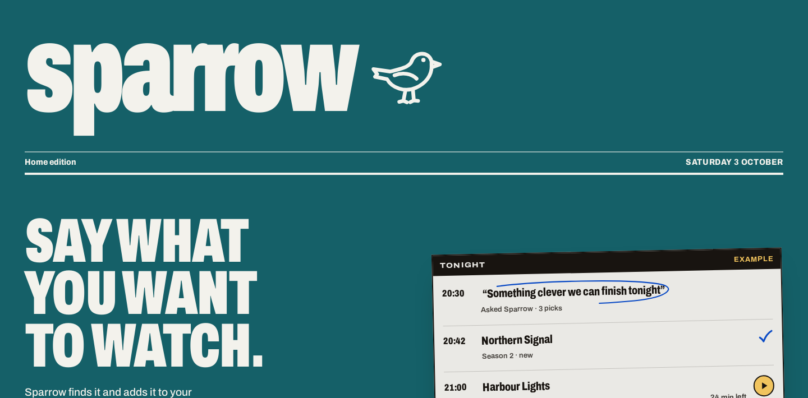 | 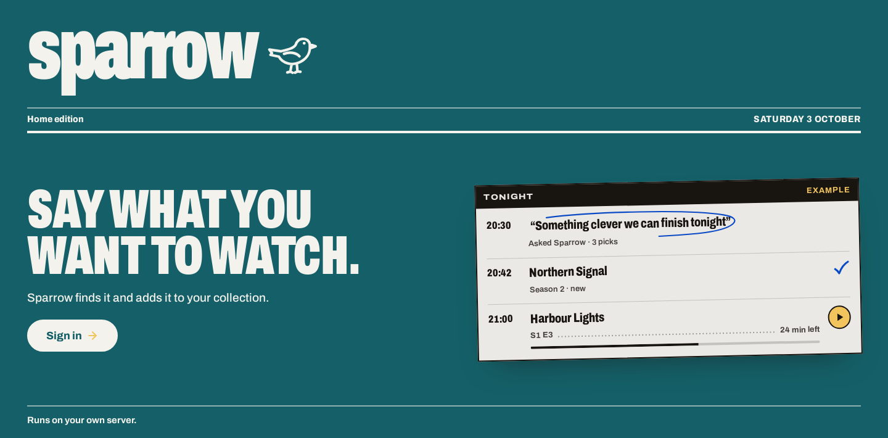 |

## Keys

The steps share the title's row, and the step has one heading, not two. Each key says
whether the server has it. OpenAI is new and optional.

| Before | After |
| --- | --- |
| 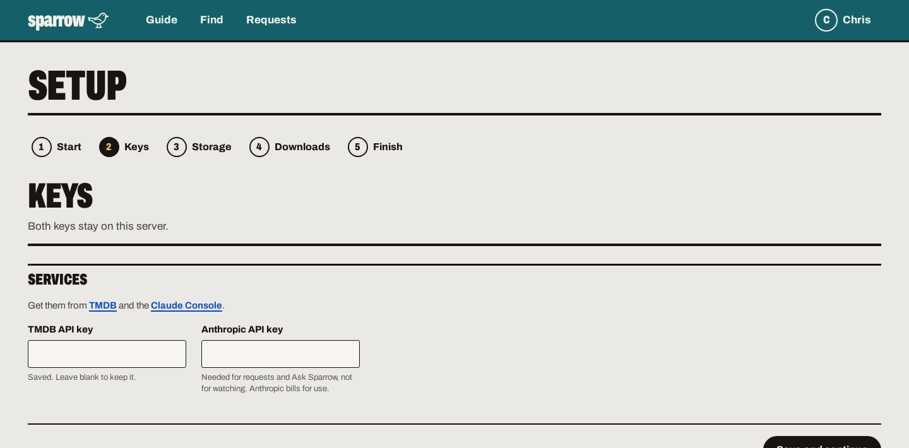 | 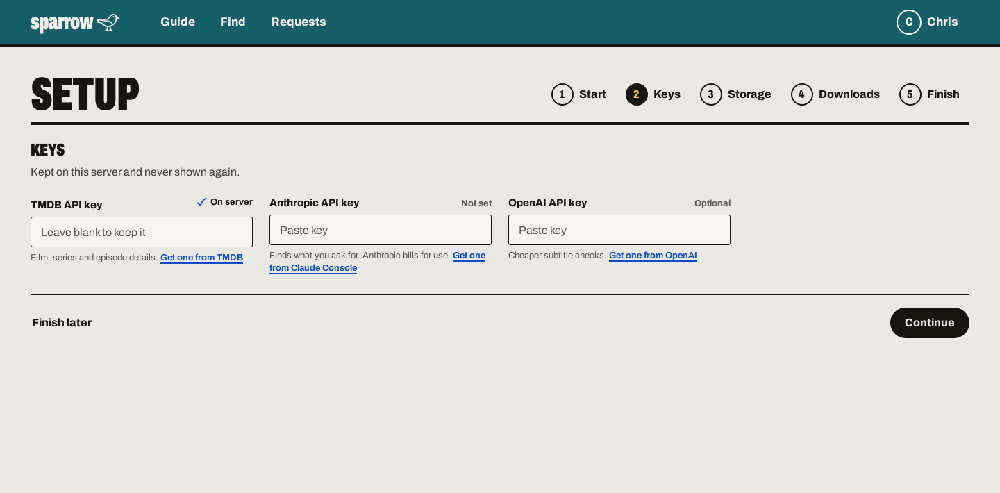 |
| 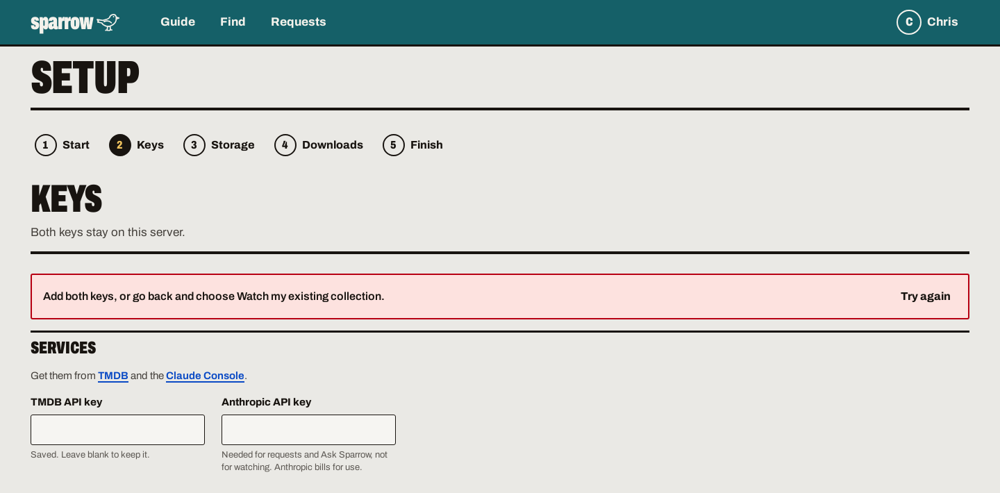 | 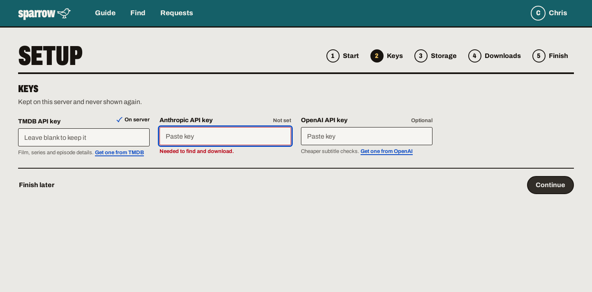 |

## Storage

Second pass after the owner's live retry (left): host paths showed as "Not found",
and the red tag's text sat at the bottom of its box because error-banner styles also
applied to red tags. Now host paths map to their Docker mount by themselves, missing
folders are created, and each folder is one listing line with its state.

| Before | After |
| --- | --- |
| 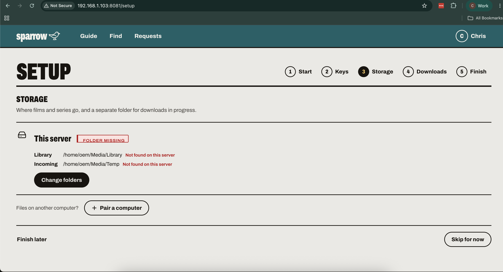 | 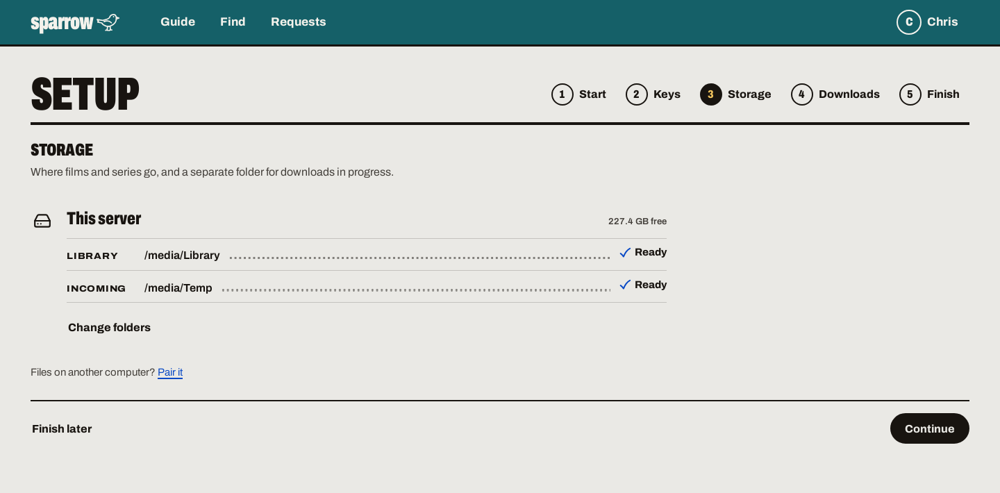 |
| | 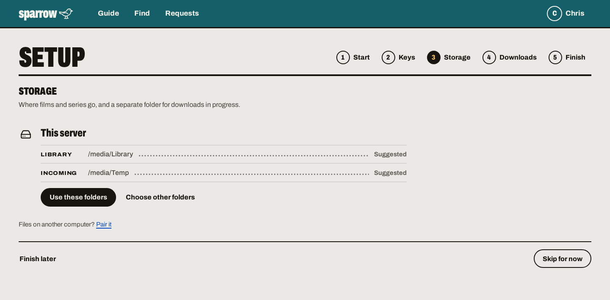 |
| | 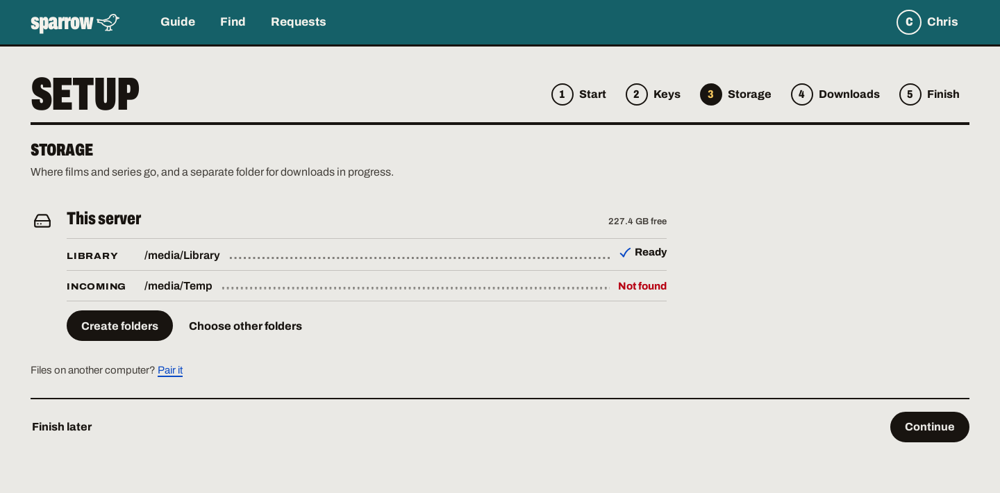 |
| | 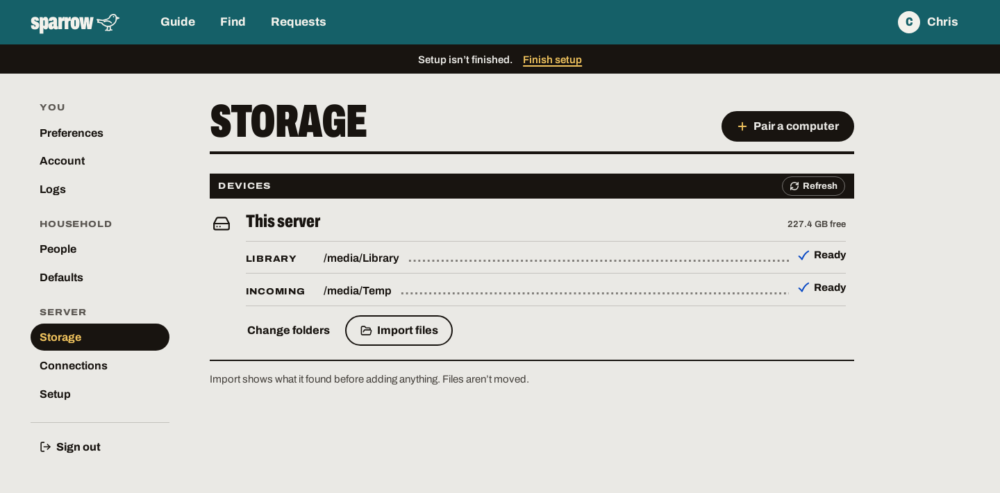 |
| | 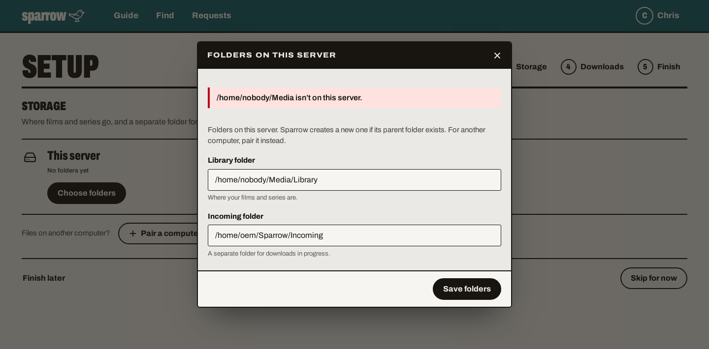 |

## Download app

Sparrow looks for one by itself. In the Docker image it offers **Set up Transmission for
me**. The Docker captures come from the built image; without Transmission installed,
setup shows the install command instead.

| Before | After |
| --- | --- |
| 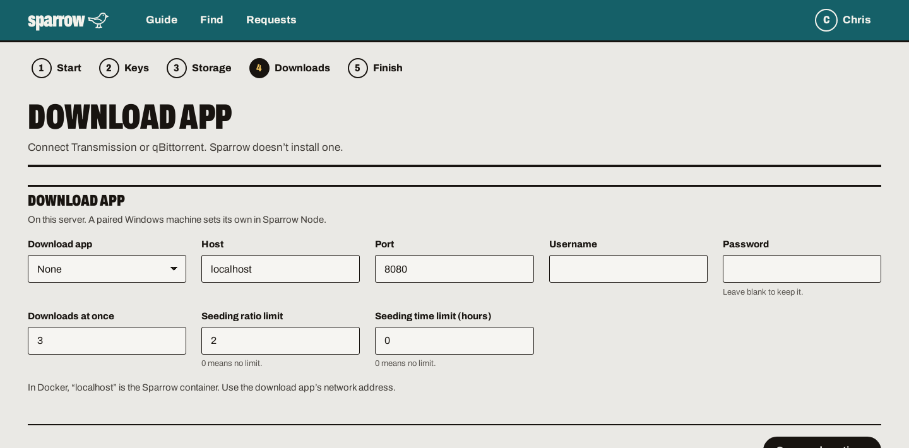 | 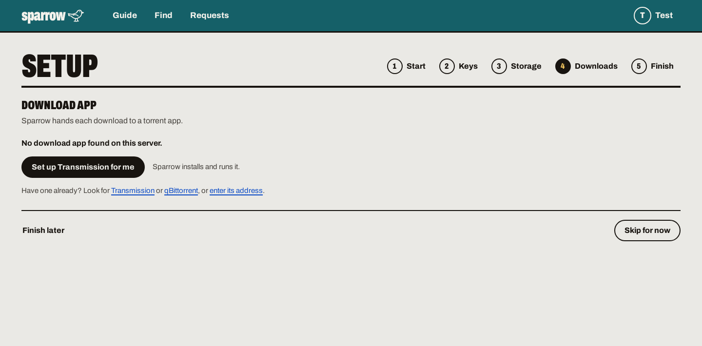 |
| | 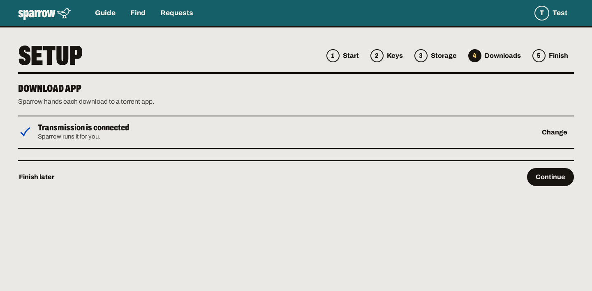 |
| | 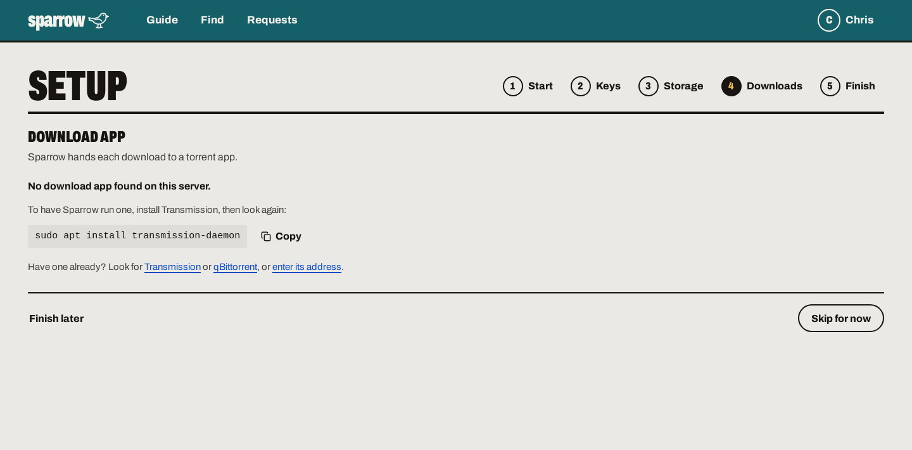 |
| | 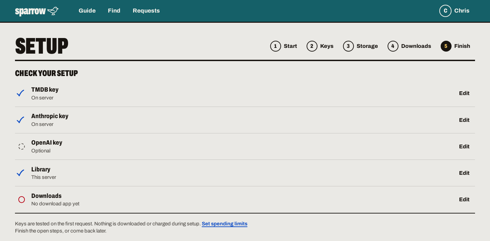 |
