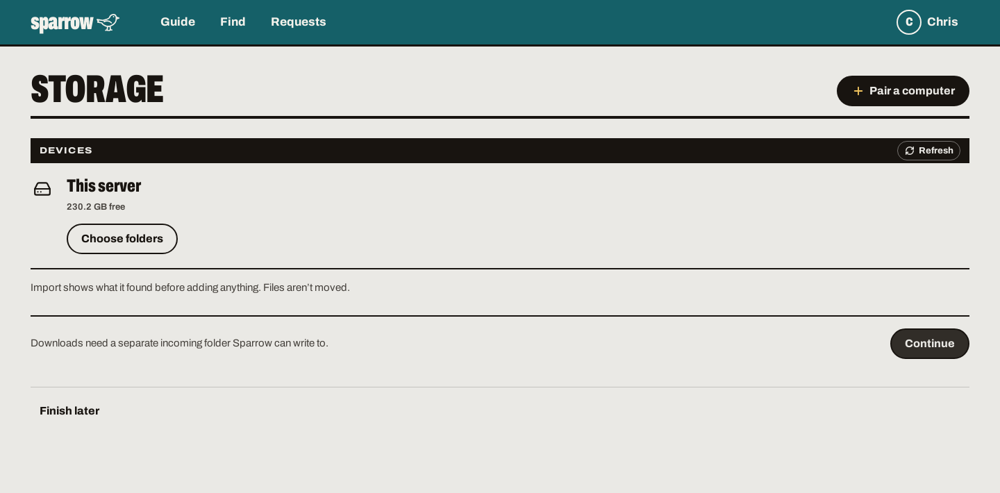
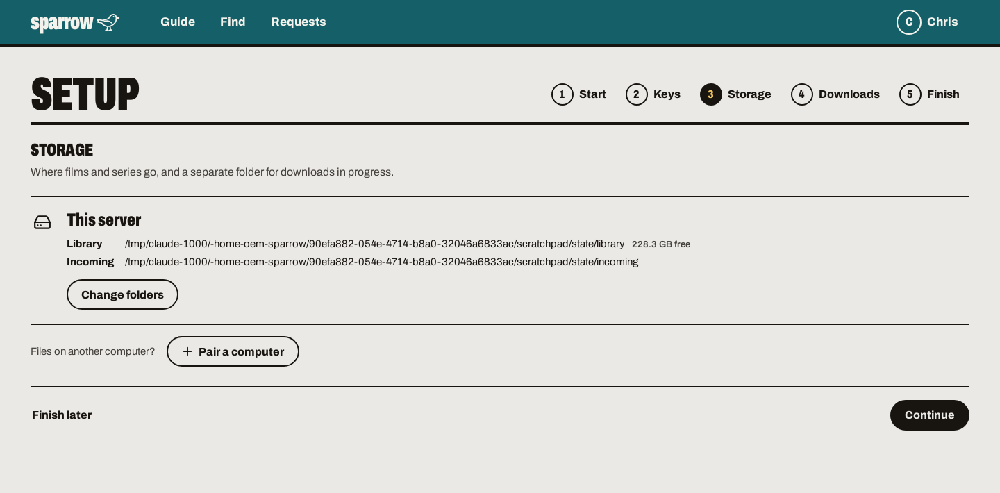

# Onboarding review: before and after

The owner's 2026-10-03 review on a 13-inch MacBook Pro. Every capture is the visible
window at 1440 × 710, Chrome's viewport on that laptop with the bookmarks bar shown.
Both sides use the same fictional fixture (`tests/browser/server.py`); before is `main` at c725487.

## Cover

The button was below the fold. Type now scales with the window's height too.

| Before | After |
| --- | --- |
|  |  |

## Keys

The steps share the title's row, and the step has one heading, not two. Each key says
whether the server has it. OpenAI is new and optional.

| Before | After |
| --- | --- |
|  |  |
|  |  |

## Storage

Red is only for a real problem. The card shows both folders, and pairing is secondary.

| Before | After |
| --- | --- |
|  |  |
| |  |
| |  |

## Download app

Sparrow looks for one by itself. In the Docker image it offers **Set up Transmission for
me**; this fixture has no Transmission installed, so it shows the install command.

| Before | After |
| --- | --- |
|  |  |
| |  |
