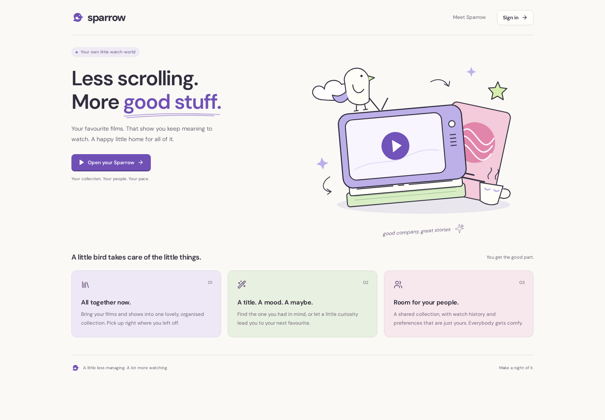

# A look around Sparrow

The approved bright interface, captured from the production frontend on
11 September 2026. These are real application screens using the isolated
browser fixture: six fictional titles, original geometric covers and generated
video. They contain no personal library, credentials or paid-provider results.

## Settle in



## Pick up where you left off


## Find something good


## Make it yours


| Screen | Desktop · 1440 × 1000 | Phone · 390 × 844 |
| --- | --- | --- |
| Welcome | [View](landing-desktop.png) | [View](landing-mobile.png) |
| Home | [View](home-desktop.png) | [View](home-mobile.png) |
| Library | [View](library-desktop.png) | [View](library-mobile.png) |
| Discover | [View](discover-desktop.png) | [View](discover-mobile.png) |
| Show detail | [View](title-desktop.png) | [View](title-mobile.png) |
| Preferences | [View](preferences-desktop.png) | [View](preferences-mobile.png) |

Phone images capture one viewport so the bottom navigation stays in its natural
position. The app scrolls normally to the remaining content. More account,
security, log, dialog and failure states are in the
[follow-up validation gallery](../follow-up-validation/README.md).

## Reproduce the captures

After installing the development prerequisites and building the frontend:

```sh
SPARROW_SCREENSHOT_OUT=docs/screenshots tests/browser/ci.sh
```

Use `SPARROW_BROWSER_PORT=8893` if the default fixture port, 8891, is already in
use. The runner creates isolated state, exercises the product journeys, then
runs `tests/browser/screenshots.cjs`. It refuses an occupied port; it does not
reuse an existing server. Test evidence and server logs go to the ignored
`tests/browser/artifacts/` directory. Default CI runs leave these checked-in
screenshots untouched.

Screenshots complement [automated checks](../IMPLEMENTATION.md); they do not
establish physical-phone, Safari/iOS, Windows or live-provider acceptance.
